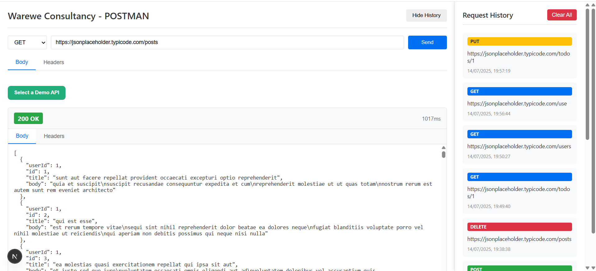

# 🧪 Warewe Consultancy - POSTMAN Clone

A lightweight and user-friendly API testing tool built with **Next.js**, allowing developers to easily make `GET`, `POST`, `PUT`, and `DELETE` requests, view JSON responses, manage headers and request body, and track request history with pagination.

---

## 🚀 Features

- ✅ Supports `GET`, `POST`, `PUT`, and `DELETE` HTTP methods
- 📬 Custom headers and JSON body input
- 📜 Pretty-printed response and headers view
- 📂 Request history saved locally (with pagination)
- 🧠 Validation for URL and request body
- 🧪 Demo APIs for quick testing (via dropdown)
- ⏱ Response time tracking
- ✨ Built with **Next.js App Router**, **TypeScript**, and **localStorage**

---

## 📸 Screenshots

 

---

## 🛠 Tech Stack

- **Frontend:** Next.js 14 (App Router), React, TypeScript
- **Styling:** CSS (custom)
- **Storage:** LocalStorage (for request history)

---

## 📦 Getting Started

Clone the repository and install dependencies:

```bash
git clone https://github.com/riteskumar/warewe-postman.git
npm install
npm run dev
```